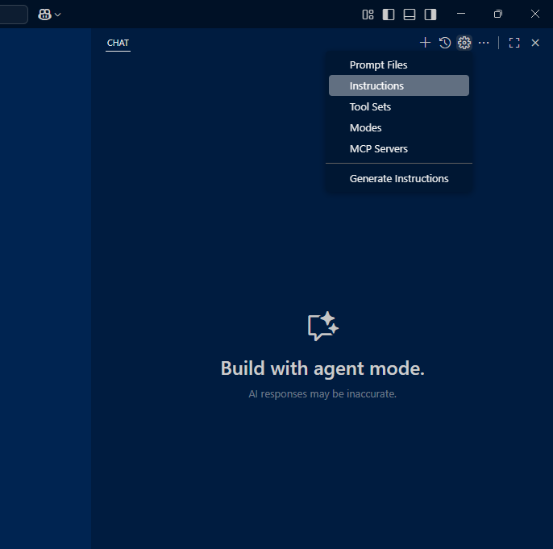
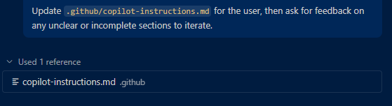

Today I'd like to show you how to make your AI agent better at ANY framework or programming language you choose for your project and to get the optimal results by leveraging the tools these AI agents put at our disposal.

## Table of Contents
- [Introduction](#introduction)
- [Context as a substitute for training](#context-as-a-substitute-for-training)
- [Setup the project](#setup-the-project)
- [Prepare instructions for the agent](#prepare-instructions-for-the-agent)
- [Add supplementary documents](#add-supplementary-documents)
- [Let's put it to the test](#lets-put-it-to-the-test)
- [Conclusion](#conclusion)

---

## Introduction

It's no doubt that coding is one of the primary targets of leading AI models. Recent iterations of known models such as GPT-5 are significantly more focused on helping developers deliver quality code. However, the knowledge of these models seem to be better when the platform of choice is less complex and requires less "homework". But what happens when you NEED to take advantage of a powerful but complex cross-platform framework in which a little bit of documentation can make everything easier?

---

## Context as a substitute for training

The reason for the problem described above is simple: AI models are trained with code available in the internet (public repos, posts in community forums, etc.) and for some platforms there's probably not enough available "examples" to train these models accurately. Fortunately, you can still make your AI model better by providing **context.** All AI models allow you to add some form of context within a specific project by including **custom instructions**, which dramatically improve the AI model's accuracy and write good code the way you expect.

Let's take the example of [Uno Platform](https://platform.uno/) - it's a powerful cross-platform framework that requires a bit of "read-ahead" and you might not get great results from your AI agent for an Uno project by relying on the "vanilla" agent experience. We need to tweak things a bit to get optimal results

---

## Setup the project.

For this example, we'll be using Visual Studio Code's agent mode but you can easily replicate this with any agentic code tool (such as Claude Code or Gemini CLI). To follow through this guide, you'll need to make sure that:

- Visual Studio Code is installed and you're signed in with a Github account to have access to Agent Mode, more info [here](https://code.visualstudio.com/docs/copilot/chat/chat-agent-mode).
- [Uno Platform is properly set-up](https://platform.uno/docs/articles/external/uno.check/doc/using-uno-check.html)

For this example, let's start with an preconfigured [Uno Platform project](https://platform.uno/docs/articles/get-started-dotnet-new.html). To make things a bit more interesting, instead of creating a classic, XAML-based Uno project, we'll use [C# Markup](https://platform.uno/c-markup/) instead (which I personally like more, but it's certainly a less popular choice), paired with the [MVUX design pattern](https://platform.uno/docs/articles/external/uno.extensions/doc/Overview/Reactive/overview.html). Choose a directory in your computer to host your project's code and execute the following command in a terminal inside said directory:

```bash
dotnet new unoapp -preset=recommended -markup=csharp 
```

Let the tool do its thing and when finished open the project's directory in VS Code. I recommend installing the [C# Dev Kit](https://marketplace.visualstudio.com/items?itemName=ms-dotnettools.csdevkit) and [Uno Platform](https://marketplace.visualstudio.com/items?itemName=unoplatform.vscode) extensions if you haven't done so.

Run the project in your plaform of choice to make sure everything went well with the initial setup. You should be greeted with a screen asking you to enter your name with a button to navigate to the second page. Do both things and make sure you're sent to the second page and your name displays in the label in the second page.

---

## Prepare instructions for the agent

So now it's time to create instructions for the AI agent so it's able to understand the project, its structure, but more importantly, the whole technology behind it. For VS Code's Github Copilot, instructions to the AI agents are provided by the means of a file (`copilot-instructions.md`) that's included by default in each conversation. You could go ahead and manually create the file and add your instructions by hand, but the VS Code team has made this a lot easier now by leveraging the very same AI agent to create it for you. 

Open Github Copilot chat (click the Github Copilot icon at the top center) and open the chat window. Then, click on the cog at the top right corner and click on the "Instructions" menu option (see below).

---



---

This will generate an initial set of instructions that will cover things like the project structure, languange and packages used etc. But we can make this even better. The document is created in the form of a markdown document and can be found in `.github/copilot-instructions.md`. This is easily modifiable, meaning you can add and edit content as neccessary to update the instructions. This file is automatically included in each conversation with Github Copilot and serves as initial context to the agent about the project.

> :bulb: If you're using other agentic coding tools, instruction files are similar, but they're usually named differently. For Claude Code, this is usually called `claude.md` and it's placed in the root of the project. For Gemini CLI, it's the same, but it's called `GEMINI.md` instead.

---

## Add supplementary documents.

Modern AI agents have the ability to browse the web. This is a huge asset because it gives the agent the ability to learn from every piece of documentation already available online. In the case of our Uno Platform C# Markup/MVUX project, the agent could benefit greatly by leveraging the detail documentation the Uno team has already put together, so we can include the links of said documentation as supplementary documentation to provide even more context.

- Create a folder in the root project called `Docs`.
- Inside the folder, create two additional markdown files, `csharp-markup.cs` and `mvux.md`.
- Add a bit of context about each of the two different Uno Platform features in each file, like this:

**In `csharp-markup.md`:**

```markdown
# C# Markup for Uno Platform

C# Markup for Uno Platform provides a declarative, fluent syntax for defining application layouts directly in C# without the need of using a separate design language. This approach allows developers to use a single language for both UI and logic, offering benefits like strong typing, compile-time validation, and easier refactoring compared to XAML.

It fully supports data binding, custom controls, and resources, as demonstrated through a simple counter application example. The documentation explains how to create controls, set properties, and bind them to a ViewModel.

For more detailed guidance, follow the following links for details on each of the specific subjects listed below:.

- [Overview](https://platform.uno/docs/articles/external/uno.extensions/doc/Learn/Markup/Overview.html)

- [Data Binding basics](https://platform.uno/docs/articles/external/uno.extensions/doc/Learn/Markup/Binding101.html)

- [Setting Source and relative source between controls](https://platform.uno/docs/articles/external/uno.extensions/doc/Learn/Markup/SourceUsage.html).

- [Converters](https://platform.uno/docs/articles/external/uno.extensions/doc/Learn/Markup/Converters.html).
```

**In `mvux.md`:**

```markdown
# MVUX

MVUX (Model, View, Update eXtended) is an application design pattern which focuses on observability of immutable values and it supports data binding right off the box.

# Architecture

MVUX relies heavily in the `Uno.Extensions.Reactive.Config.BindableGenerationTool` to streamline the data binding process, but in order to work seamlessly it requires a specific naming convention to automatically connect the UI (pages) with the logic (view model).

- *Page class name:* Class `<ObjectName>Page` placed in `<ObjectName>Page.cs`: For example `public class CustomerPage`.
- *Model name:* Record `<ObjectName>Model` placed in `<ObjectName>Model.cs`: For example `public record CustomerModel`

The generator should then automatically create a bindable intermediate class called `<ObjectName>ViewModel` that will be used as a data context for the page class and allows access to the main model's properties and methods.

# Further reference

Note that the examples in the documentation listed below assume a traditional Uno Platform app using XAML. It's important to note that this project uses C# Markup instead of XAML, so for these examples, the IU examples in XAML need to be "translated" into C# markup.

[ Add links to the Uno Platform MVUX documentation (see the C# markup example) ]
```

Note that in each file we're providing as much context as we can. This is key. The AI agent will use ALL of this during a conversation to provide context about the architecture of the project.

Finally, add a reference to both files to the `copilot-instructions.md` file so the AI agent picks it up:

```markdown
## Reference Documentation

- MVUX pattern details: `Docs/mvux.md`
- C# Markup guide: `Docs/csharp-markup.md`

Make sure to follow the links for more details about each individual topic whenever more context is needed.
```

---

## Let's put it to the test

Now that we have a project with proper AI agent instructions, let's try it out. Open the Github Copilot chat window and start a new conversation (click on the "+" button at the top right). Make sure at the bottom left of the chat window the "Agent" mode is selected (not "Ask" or "Edit"), and select any AI model you'd like to use (I tried this with Claude Sonnet 3.5). Add the following text to the conversation window:

```
Add a standard sign in page to the project. Make sure it has username, password and a "Remember me" checkbox, and of course a button for initiating the sign in. The sign in process should be handled by a user service, but for now, just add a sign in method to the service that just signs in the user (we'll add the rest of the service later, add comments to the service specifying this).The new page should be displayed first when the app launches and upon successful sign in, it should redirect the user to the main page.
```

Note that this prompt is detailed enough to tell the AI agent what we want it to do. It's not a bad idea to add more detail, but even things like "The sign in process should be handled by a user service" can be added as part of the instructions, so you don't need to specify it every time.

Press "Enter" to begin the conversation. You'll notice that the following shows up under your message.

---



---

This means the agent is correctly picking up our instructions file and adding the entire context to the conversation (including the referenced individual documents and the online documentation).

If everything went expected, you can run the app again and now you should have a working sign in page that uses a user service to initiate the sign in process and redirects you to the main page when clicking in the "Sign in" button. It's still possible it has made a few mistakes, but they should be easy to fix.

---

## Conclusion

Adding proper instructions to your cross-platform .NET project can turn your AI agent into a true expert in your platform of choice and it should help you speed-up development even further with less errors. You can then concentrate in improving the logic and making the overall experience of the app better. Feel free to experiment with this approach and personalize your instructions as much as you like. The more context you provide, the smarter your AI agent will be.