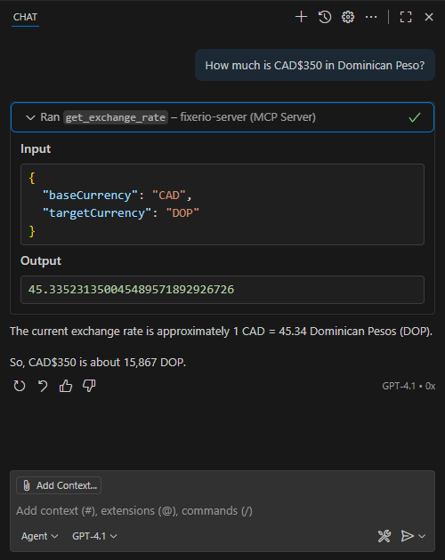

If you're a C# developer chances are you already have the tools you need to build an MCP server from scratch. No, really. If you're a C# dev, it's likely that you already have VS Code and .NET installed in your system. This is really enough. In this article I'll walk you through creating your own MCP server using just that.

## What you'll need

- [.NET 9.0 SDK or higher.](https://dotnet.microsoft.com/en-us/download).
- [Visual Studio Code](https://code.visualstudio.com/) is recommended, but you can also use any code editor or .NET IDE you want.

## Preparing the project.

For this example, we'll build a super simple MCP server that we'll use to convert between currencies using [fixer.io](https://fixer.io). It's a free, simple and lightweight API that provides current and historical exchange rates between any currencies. 

You'll want to start with a .NET console project to host the MCP server logic. Open your terminal (or Command Prompt/Powershell if you're on Windows) and enter the following inside an empty folder:

```bash
dotnet new console -n FixerIO
```

## The `ModelContextProtocol` package.

The `ModelContextProtocol` is the secret sauce that will allow you to put together the pieces you need for your MCP server. At the time of this writing, it's still in pre-release. In the same terminal, enter the following command:

```bash
dotnet add package ModelContextProtocol --prerelease
```

We also need to add a second package to support interaction with AI agents and related tools. In the same terminal, enter the following:

```bash
dotnet add package Microsoft.Extensions.Hosting
```

## Writing the tools.

MCP servers work by exposing tools to AI agents. Each tool represents a distinct task that the MCP server is able to perform and it usually includes a description that provides context to consuming AI agents about its purpose. For this particular MCP server we want to provide a tool that's able to return the conversion rate between two given currencies. So let's start by provide a class that houses this tool.

1. Open VS Code and open the directory where your new console project was created.
2. Create a new directory in the root of the project and name it "Tools"
3. Inside the new "Tools" folder, create a new file and name it `FixerIOTools.cs`.
4. Add the following code in the new file:

```csharp
using System.ComponentModel;
using ModelContextProtocol.Server;

[McpServerToolType]
public class FixerIOTools
{

}
```

The `[McpServerToolType]` is important because it identifies the class as a set of tools that can be exposed by our MCP server. Now, we need to make our set of tools available to consumers. Let's continue with changing the defaut `Program.cs` file to build the foundation of our MCP server and expose our new tool. Open the `Program.cs` file and replace the default code with the following:

```csharp
using Microsoft.Extensions.DependencyInjection;
using Microsoft.Extensions.Hosting;
using Microsoft.Extensions.Logging;

var builder = Host.CreateApplicationBuilder(args);
builder.Logging.AddConsole(consoleLogOptions =>
{
    // Configure all logs to go to stderr
    consoleLogOptions.LogToStandardErrorThreshold = LogLevel.Trace;
});

builder.Services
    .AddMcpServer()
    .WithStdioServerTransport()
    .WithTools<FixerIOTools>(); // This exposes our tools via our MCP sever

await builder.Build().RunAsync();
```

## Environment variables

More often than not, your MCP server will require parameters that need to be provided by consumers. For example, your MCP server might need a personal access token to authenticate requests to a secure API. These can be provided via **environment variables**. Environment variables are perfect for MCP servers, because they're available globally in the program and can be reused where needed. In a C# MCP server, environment variables can be leveraged via the static `Environment` class.

In the case of our MCP server, an API key is required to perform requests to the Fixer.io API. We can modify our MCP server project to expect an environment variable and provide feedback to consumers if the variable is not present. To that end, add the following code to the bottom of the `Program.cs` file:

```csharp
string fixerIoKey = Environment.GetEnvironmentVariable("FIXER_IO_KEY");

if (string.IsNullOrEmpty(fixerIoKey))
{
    var logger = builder.Services.BuildServiceProvider().GetRequiredService<ILogger<Program>>();
    logger.LogWarning("FIXER_IO_KEY environment variable is not set. MCP server will not function correctly.");
}
```

## Creating the currency exchange tool

So now we have a properly configured MCP server and an exposed set of tools. Now it's time to create the actual tool that will perform the task that we want the MCP server to do. In a C# MCP server, each tool is exposed as a method of the container tools class. So the next step is to create a method to calculate the exchange rate between two currencies. We do this by adding the following method to the `FixerIOTools` class:

```csharp
[McpServerTool, Description("Get the latest exchange rate between two currencies using the Fixer.io API.")]
public async Task<decimal> GetExchangeRateAsync(
    [Description("The base currency code, e.g. 'USD'")] string baseCurrency,
    [Description("The target currency code, e.g. 'EUR'")] string targetCurrency)
{
}
```

Two things stand out here:
- The `[McpServerTool]` attribute is the key ingredient to make the tool usable to consuming AI agents.
- The `[Description]` attribute provides context to consuming AI agents about its function. Conversational AI agents use this to infer what things the tool is supposed to do. It's very important to be as detailed as possible to avoid confusing the AI agents.

Now that the tool is defined, let's finish up by writing the rest of the logic. Complete the implementation of the `GetExchangeRateAsync` method by adding the following:

```csharp
[McpServerTool, Description("Get the latest exchange rate between two currencies using the Fixer.io API.")]
public async Task<decimal> GetExchangeRateAsync(
    [Description("The base currency code, e.g. 'USD'")] string baseCurrency,
    [Description("The target currency code, e.g. 'EUR'")] string targetCurrency)
{
    var fixerIoKey = Environment.GetEnvironmentVariable("FIXER_IO_KEY");

    if (string.IsNullOrEmpty(fixerIoKey))
    {
        throw new InvalidOperationException("FIXER_IO_KEY environment variable is not set.");
    }

    var url = $"http://data.fixer.io/api/latest?access_key={fixerIoKey}";
    Console.WriteLine("Requesting exchange rate from {0}", url);

    var response = await new HttpClient().GetAsync(url);
    response.EnsureSuccessStatusCode();

    var content = await response.Content.ReadAsStringAsync();
    var json = System.Text.Json.JsonDocument.Parse(content);

    if (json.RootElement.GetProperty("success").GetBoolean() == false)
    {
        var errorInfo = json.RootElement.GetProperty("error").GetProperty("info").GetString();
        throw new InvalidOperationException($"Error from Fixer.io API: {errorInfo}");
    }

    var rates = json.RootElement.GetProperty("rates");

    decimal rate;
    if (string.Equals(baseCurrency, "EUR", StringComparison.OrdinalIgnoreCase))
    {
        // If base is EUR, just return the rate for the target currency
        rate = rates.GetProperty(targetCurrency).GetDecimal();
    }
    else if (string.Equals(targetCurrency, "EUR", StringComparison.OrdinalIgnoreCase))
    {
        // If target is EUR, return 1 / rate for base currency
        var baseRate = rates.GetProperty(baseCurrency).GetDecimal();
        rate = 1 / baseRate;
    }
    else
    {
        // Cross-rate: (rate for target) / (rate for base)
        var targetRate = rates.GetProperty(targetCurrency).GetDecimal();
        var baseRate = rates.GetProperty(baseCurrency).GetDecimal();
        rate = targetRate / baseRate;
    }

    Console.WriteLine("Exchange rate from {0} to {1} is {2}", baseCurrency, targetCurrency, rate);
    return rate;
}
```

As you can see, the method's logic is pretty straight-forward. We use the `FIXER_IO_KEY` environment variable to retrieve the Fixer.io API key and we use this to make a `GET` request to the Fixer.io API. We then process the API's response in JSON format and make the neccessary calculations to return the currency rate between the two currencies. Since the free version of Fixer.io only returns the currency rates using `EUR` as a base currency, we also provide cross-rate functionality to allow consumers convert between any two currencies.

This is it. Really. We're done with the MCP server. But you also want to see it in action, don't you? 😏

## Let's test it!

A C# MCP server can be used in a number of ways. The most common way to publish an MCP server is in dockerized format, which would be perfectly possible by just building the project and deploying using `dotnet publish /t:PublishContainer`. For the sake of simplicity, however, we'll be testing this locally by running our MCP server project directly through the `dotnet` executable itself.

First thing you'll need to test this is a Fixer.io API key. You can get one for free [here](https://fixer.io/signup/free). Once you have it, save it someplace safe. **NEVER PUBLISH YOUR API KEY TO A REPOSITORY.**

Next, we need to build our MCP server project. Go back to your terminal and enter the following command:

```bash
dotnet build FixerIO.csproj /p:Configuration=Release
```

If you have the C# Dev Kit extension installed you can also build the project by right-clicking on the project file and selecting the "Build" option.

Go back to your project in VS Code and create a folder named `.github` in the root of the project and inside it, create an `mcp.json` file and add the following code (replace `/path/to/your/mcp-server/project` with the path of your project):

```json
{
    "servers": {
        "fixerio-server": {
            "type": "stdio",
            "command": "dotnet",
            "args": [
                "run",
                "--project",
                "/path/to/your/mcp-server/project"
            ],
            "env": {
                "FIXER_IO_KEY": "${input:api-key}"
            }
        }
    },
    "inputs": [
    {
        "type": "promptString",
        "id": "api-key",
        "description": "Enter your Fixer.io API key",
        "password": true
    }]
}
```

If everything went well, you should be able to see something like this right above the `fixerio-server` section:


Click on the "Start" button and make sure it reads "Running". If it doesn't, check the "Output" panel on VS Code (make sure the MCP Server filter is selected) and check the messages, it should give you a clue of what is wrong.


The first time you run the MCP server, you'll see a prompt at the top reading "Enter your Fixer.io API key". Enter the API key you got earlier. This will be saved in your mcp.json file for easy access. You can see that we're also defining an environment variable called `FIXER_IO_KEY` which points to whatever value we enter in the prompt called `api-key`. This will map directly to the Environment variable we're using in our MCP server project.

Once the MCP server is running and the API key is provided, open Github Copilot chat, change the mode to "Agent" and click on the "Tools" button at the bottom right of the chat pane.


This will open the "Configure Tools" panel where all of the available agentic tools are displayed. You'll see your new MCP server listed at the bottom as `fixerio-server`. If you expand it, you'll see a tool named `get_exchange_rate` with the description you provided previously. This means Github Copilot will automatically use your MCP server whenever the conversation picks up a potential use for it.


Make sure the tool is selected (i.e., checked) and click "OK" in the "Configure Tools" panel at the top to accept the selected tools. Now, for the final test, go back to the chat pane and ask it to convert an amount from one currency to the other. You'll notice Github Copilot will ask you to use your MCP server for the task.



## Conclusion

Writing an MCP server in C# is extremely easy and makes for a great way to extend the functionality of agentic AI tools. Because C# MCP servers follow the Model Context Protocol standard, you'll be able to use your C# MCP servers with any existing AI agents, such as Claude Desktop, Gemini CLI and Github Copilot.

If you want to play around with this example, you can find the completed project in my [Github page](https://github.com/lesterbotello/FixerIO). Happy coding!