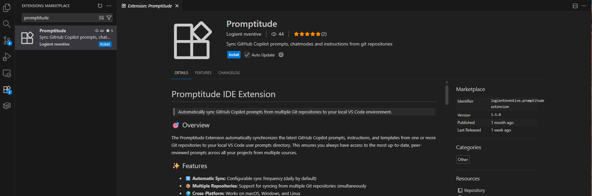
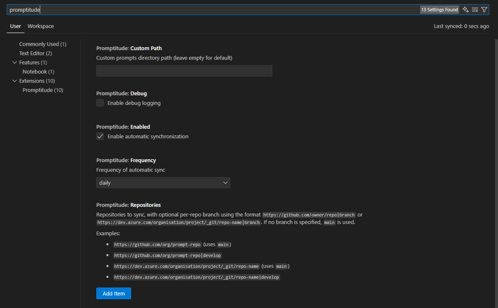
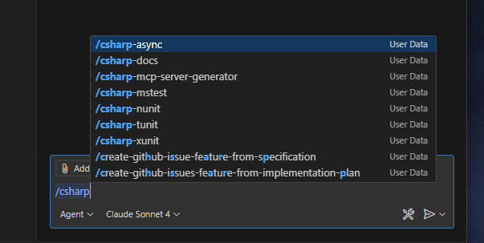

If you're working in a project in active development, you're probably doing a lot of tasks that you've done before and/or will likely be doing again in the future. For example, you might need to add functionality to your app to call a given REST API, deserialize its JSON response to create a DTO and then transform it into a domain object. You'll likely need to do the exact same process everytime you need to connect to a new endpoint, since the endpoint, the returned data and its purpose itself will be different, but the implementation steps will remain unchanged. Interestingly, this particular task is very common in software development in general, and one could argue that automating this process would be beneficial for any project of the same type.

If you're using Visual Studio Code for development and are doing AI-assisted development, you can leverage **prompt files**, which are reusable instructions for Github Copilot that allow you to ask the agent perform a specific process in a repeatable way. VS Code allows you to reuse prompts at two levels:
- **Workspace prompts** are available for a specific project or workspace and they're saved in the `.github/prompts` folder in the root of the workspace.
- **User prompts** are available to all projects, and are stored in a special file in the VS Code profile.

## Structure
Prompt files themselves are nothing more than markdown files that follow a specific set of conventions:

- They follow the format `name-of-prompt.prompt.md`
- They use a YAML frontmatter header to specify things like its purpose, the prefered mode in which it will be used and which tools it'll require.

```yml
---
mode: agent
model: GPT-5
tools: ['githubRepo', 'search/codebase']
description: "Implement an API call in the application"
---
```

## Contents

Apart from the header, the contents of prompt files should usually follow the same overall format of a prompt you'd use to make a request for the AI agent on the fly. In consequence, the more context you provide and the more specific your request is, the more effective your prompt will be at achieving the desired outcome. It's a good idea to observe good prompting practices to ensure the best results (here's a [great guide from OpenAI](https://help.openai.com/en/articles/6654000-best-practices-for-prompt-engineering-with-the-openai-api) about best prompting practices.).

Also, keep in mind that if your project is using an instructions file, these will be included in the conversation (see my [previous article](../20250817/) about AI agent instructions). Make sure the prompt takes into consideration any instructions provided via instructions files, to avoid providing conflicting information that could end up confusing the agent.

You can also customize your prompt is by using input variables to request additional information for your prompt via the chat input field.

You can find more about prompt files by looking at the [Visual Studio Code documentation](https://code.visualstudio.com/docs/copilot/customization/prompt-files).

## Prompt collaboration

As you build your collection of prompts, you'll find that some of them are worth sharing with other members of your team. A great way to collaborate with prompt building is by pairing a centralized prompt repository with the [Promptitude VS Code Extension](https://marketplace.visualstudio.com/items?itemName=Logientnventive.promptitude-extension). Promptitude allows you to synchronize prompts and instructions from a set of known prompt repositories. You can create a repository for your team or organization and have everyone install Promptitude to share prompts between them.

**Note:** Promptitude is currently in alpha phase, which means frequent changes to the functionality of the extension should be expected.

Here's how to get started with Promptitude:

1. Create a directory inside your usual development directory and inside it create three directories: `prompts`, `instructions` and `chatmodes`.
2. Place all of the prompt files you'd like to share with your team in the `prompts` directory. Make sure they follow the format explained above. You can do the same with instructions if you have them (place these in the `instructions` directory).
3. Initialize a git repository using `git init`, commit your changes and push them to a repository in your organization. Take note of the URL of the repository.
4. Ask your team members to download Promptitude from VS Code (see below). Alternatively you can download it from the [VS Code website for the extension](https://marketplace.visualstudio.com/items?itemName=Logientnventive.promptitude-extension).



5. Once installed, open VS Code Settings (click on the cog at the bottom right or press `Ctrl+,` on Windows/Linux or `Cmd+,` on Mac) and search for "promptitude" in the search bar.



6. Click on "Add Item" and type in the URL of the repository you took note of in step 3.

7. Finally, click on the "✔️ Prompts" indicator at the bottom right to initiate the sync. Restarting VS Code should also do the trick. If everything went well, you should have new prompts to sync.

8. To test your prompts, you can press `/` within the Github Copilot chat window and start typing the name of one prompt. You'll notice they will be suggested to you.



9. You can also use Promptitude to take advantage of some noteworthy collections of prompts already existing. A good place to start looking is the [awesome-copilot repository](https://github.com/github/awesome-copilot), which contains a constantly-growing collection of great prompts and instructions.

## Conclusion

The Promptitude extension makes it super easy to take advantage of existing prompts, share them within your team and collaborate more effectively using AI. You can also take advantage of some incredibly useful community prompts to boost your AI assisted development.