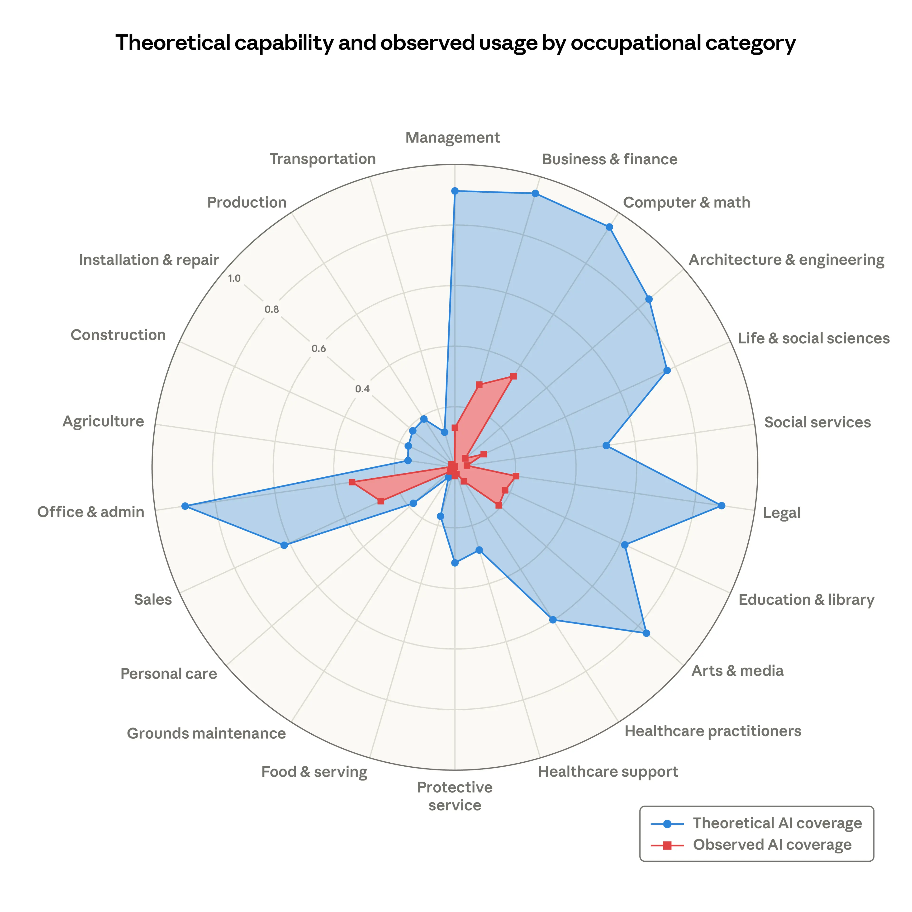

If you’ve been following the recent labor market impact assessments—specifically the [latest research from Anthropic](https://www.anthropic.com/research/labor-market-impacts)—the numbers look startling at first glance. Computer programmers are listed at the very top of the "exposed" list, with a staggering 75% of our tasks identified as being within the reach of AI automation.

But as someone who has navigated the industry for over two decades, I can't shake the feeling that I’ve kind of seen this movie before. Long before I started coding, assembler experts were alarmed with the rise of COBOL and Fortran. Flashforward a few decades and the rise of IDEs were the new cause of panic, followed by the "low-code" movement, and the offshore outsourcing waves a few years later. Each time, the narrative is the same: The end of the software development career is near.

Yet, if you look past the "75% exposure" headline and dive into the actual data and the sentiment in the trenches, a very different story emerges. We aren't losing the battle; we are undergoing a massive, career-defining promotion.

## There's a Gap Between Theory and Reality

The Anthropic report, makes a critical distinction that most news outlets seem to miss. While it notes that nearly 94% of computer and mathematical tasks theoretically could be accelerated by AI, the actual observed usage in real-world professional settings is only 33%.

Why is there such a massive gap? Because software engineering has never been just about typing syntax. It’s about context, edge cases, legacy debt, and—most importantly—understanding what the business actually needs. AI is incredibly fast at generating solutions, but it is still learning how to understand problems.

When people talk about AI "threatening" jobs, they are looking at the output (the code) rather than the outcome (the system).

## Will a "vibe-coder" really replace you?

I stumbled into a recent, heated [discussion on Reddit](https://www.reddit.com/r/ClaudeAI/comments/1rnhjrk/we_professional_developers_already_lost_the/) about the death of professional development, where a veteran engineer claimed teams were being replaced by "vibe coders"—people who just prompt their way through a project without understanding the underlying logic.

The fear is that we are being replaced by "spot-checkers." But the consensus from the most successful engineers in that same discussion was a wake-up call for all of us: **You don’t get replaced by AI; you get replaced by another engineer who uses AI better than you.**

If you treat AI as a replacement for thinking, you’ll end up with "AI slop"—code that works in isolation but collapses under the weight of a real production environment ([here's yet another example](https://news.ycombinator.com/item?id=47278720) that made the news recently). But if you treat AI as a "super-powered junior developer," you become the Architect. You move from being a manual typist to a high-level director of agentic workflows.

## Congratulations, you're now promoted to systems architect.

The shift we are seeing isn't a reduction in the need for expertise; it's a relocation of it.

1. **Lowering the Ceiling for Junior Tasks:** AI is undeniably good at the "boring stuff"—boilerplate, unit tests, and basic CRUD operations. This means the barrier to entry is changing, but it also means senior developers can finally stop spending 60% of their day on low-value tasks.

2. **The Rise of the "Full-Stack Engineer":** With AI handling the heavy lifting of unfamiliar languages or frameworks, we are becoming more versatile. For example, a backend specialist can now capably navigate a complex frontend state-management issue in half the time and with AI tools being common-place this is increasingly becoming an **expected** skill.

3. **The Premium on Judgment:** As AI generates more code, the value of the "Reviewer" and the "Validator" skyrockets. Companies don't need fewer developers; they need developers who can architect resilient systems and ensure the AI-generated components don't create a mountain of technical debt (which they undoubtedly will).

## AI will empower you, but never replace you

The Anthropic data shows no systematic increase in unemployment for highly exposed roles since late 2022. While hiring for entry-level roles has seen a slight, tentative slowdown, the demand for people who can drive these tools is higher than ever.

The "threat" of AI is only a threat if you refuse to evolve. We are moving into an era where our value isn't measured by how many lines of code we can write in an hour, but by our ability to design guardrails, specify implementation plans, and manage an "autonomous army" of agents to build products that were previously impossible for a single human to create.

Don’t fear the 75% exposure. Embrace the 10x empowerment. The era of the "syntax specialist" might be fading, but the era of the Augmented Architect has just begun.